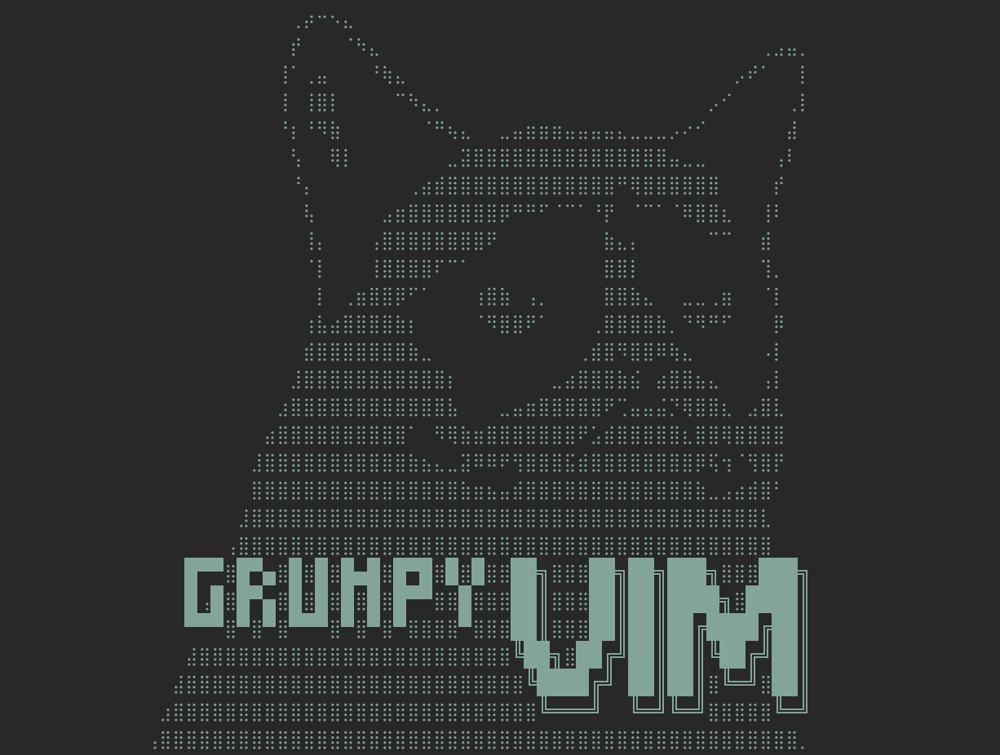

<p align="center">
  
</p>

# grumpy-vim

Personal Neovim setup

## Install

Setup installation path

```shell
export INSTALL_DIR=~/<path to install directory>
```

Clone files

```shell
git clone https://github.com/edylim/grumpy-vim $INSTALL_DIR
```

Install required modules with brew

```shell
cd $INSTALL_DIR && brew bundle
```

Overwrite nvim config.

```shell
ln -sf $INSTALL_DIR ~/.config/nvim
```
